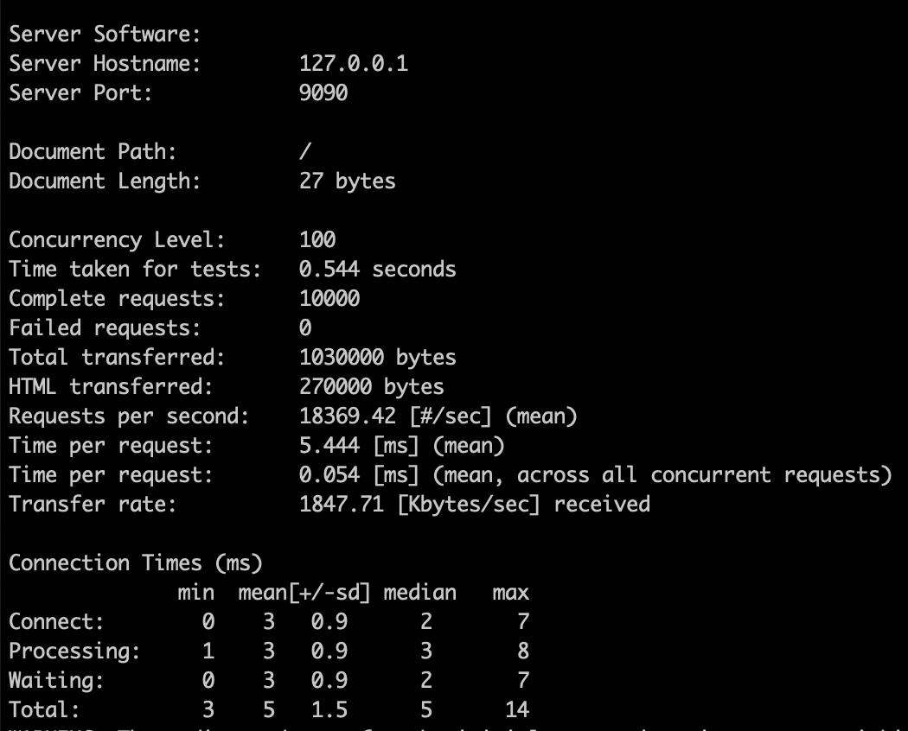

# wasp

WebAssembly Service Porter.

## Install

```shell
cargo install --git https://github.com/henrylee2cn/wasp.git
```

*Will be installed to `~/.cargo/bin`*

## try it

maybe pre-install:

```shell
rustup target add wasm32-wasi
```

build example:

```shell
git clone https://github.com/henrylee2cn/wasp.git
cd wasp/rust/simple
cargo build --release
```

serve it:

- In wasp root path, fast run alias:

```shell
cargo run-simple-release
```

[more alias](.cargo/config.toml)

- Directly use the command line:

```shell
wasp serve --threads=16 127.0.0.1:9090 rust/examples/simple/target/wasm32-wasi/release/simple.wasm
```

## Benchmark

- MacBook Pro (13-inch, 2020, Four Thunderbolt 3 ports)
- CPU: 2.3 GHz 4 Cores Intel Core i7
- Mem: 32 GB 3733 MHz LPDDR4X

```shell
ab -c 100 -n 10000 http://127.0.0.1:9090/
```

Result: 18K QPS


